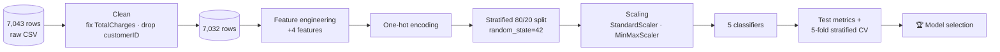
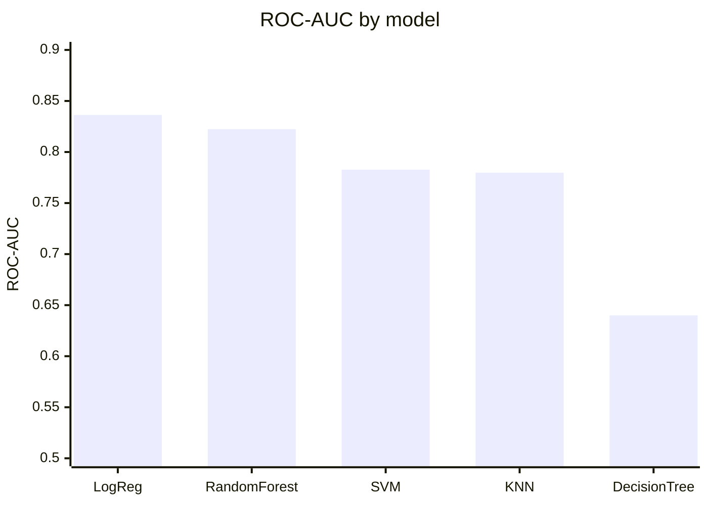

<p align="center">
  
</p>

<p align="center">
  
</p>

<p align="center">
  
  
  
  
  
  
</p>

---

## 🧠 What I Built

An end-to-end **churn-prediction study** on the IBM Telco Customer Churn dataset, completed for Week 3 of a Data Science internship (Feature Engineering, Model Building & Feature Scaling). I cleaned the data, engineered new features, compared **five classifiers** under the same protocol, and justified the final model in a written report.

**My role:** individual assignment — all cleaning, feature engineering, modelling, evaluation and the report are my own work.

---

## 🔁 Pipeline



### Data cleaning

- `TotalCharges` was stored as text with blanks for brand-new customers → converted to numeric; the **11 invalid rows** removed (7,043 → 7,032).
- `customerID` dropped as a non-predictive identifier.
- Target imbalance analysed before modelling (churners are the minority class), which is why F1, recall and ROC-AUC matter more than accuracy here.

### Engineered features

| Feature | Idea |
|---|---|
| `AvgMonthlySpend` | Total charges ÷ tenure — real average spend, robust for new customers |
| `ContractCommitment` | Contract type mapped to an ordinal commitment level (month-to-month → two-year) |
| `ServiceCount` | Number of add-on services a customer subscribes to |
| `ChargeCommitmentInteraction` | Interaction between monthly charges and commitment — high bill + low commitment is a churn signal |

---

## 📊 Results

| Model | Accuracy | Precision | Recall | F1 | ROC-AUC | CV F1 (mean ± std) |
|---|---:|---:|---:|---:|---:|---:|
| 🏆 **Logistic Regression** | **0.8038** | 0.6503 | **0.5668** | **0.6057** | **0.8363** | **0.5931 ± 0.022** |
| Random Forest (200 trees) | 0.7854 | 0.6169 | 0.5080 | 0.5572 | 0.8224 | 0.5663 ± 0.019 |
| Support Vector Machine | 0.7974 | **0.6540** | 0.5053 | 0.5701 | 0.7827 | 0.5779 ± 0.010 |
| K-Nearest Neighbors | 0.7633 | 0.5553 | 0.5508 | 0.5530 | 0.7798 | 0.5578 ± 0.010 |
| Decision Tree | 0.7122 | 0.4608 | 0.4866 | 0.4733 | 0.6400 | 0.5031 ± 0.024 |



### Why Logistic Regression won

It led on accuracy, recall, F1, ROC-AUC **and** cross-validated F1, so its lead isn't a lucky split. The strongest signals — contract commitment, charges and tenure — relate to churn in a close-to-linear way, and the model's coefficients are interpretable — a telecom team can see *why* a customer is flagged. The Decision Tree overfit, which is exactly the problem Random Forest's bagging reduces.

**Limitation & next step:** recall of ~57% means roughly 4 in 10 churners are missed. Class weighting or SMOTE and threshold tuning toward recall would be the next experiment, since missing a churner usually costs more than a false alarm.

---

## 📂 Files

| File | Contents |
|---|---|
| `Telco_Customer_Churn_Week3.ipynb` | Full analysis and modelling notebook |
| `Telco_Customer_Churn_Week3_Report.pdf` | Written report with algorithm research and justification |
| `WA_Fn-UseC_-Telco-Customer-Churn.csv` | IBM Telco Customer Churn dataset |

```bash
pip install pandas numpy scikit-learn matplotlib jupyter
jupyter notebook Telco_Customer_Churn_Week3.ipynb
```

<p align="center">
  
</p>
